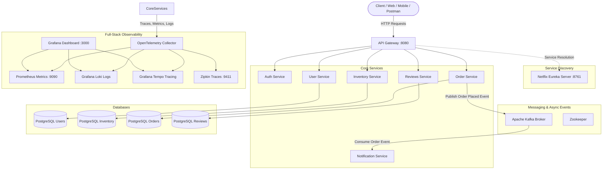

# 🛍️ Cloud-Native E-Commerce Microservices Platform

[](https://www.oracle.com/java/)
[](https://spring.io/projects/spring-boot)
[](https://spring.io/projects/spring-cloud)
[](https://www.postgresql.org/)
[](https://kafka.apache.org/)
[](https://www.docker.com/)
[](https://grafana.com/)
[](https://github.com/features/actions)
[](https://github.com/aniket252005)

A distributed, event-driven e-commerce platform built with **Spring Boot**, **Spring Cloud**, **Apache Kafka**, and **PostgreSQL**. The platform incorporates an edge **API Gateway**, service discovery with **Netflix Eureka**, asynchronous order notifications via **Kafka**, centralized **JWT Authentication**, and full-stack observability with **Grafana, Prometheus, Loki, and OpenTelemetry**.

---

## 📑 Table of Contents

- [Architecture Overview](#-architecture-overview)
- [Microservices Ecosystem](#-microservices-ecosystem)
- [Technology Stack](#-technology-stack)
- [Observability & Monitoring](#-observability--monitoring)
- [Getting Started](#-getting-started)
  - [Prerequisites](#prerequisites)
  - [1. Quickstart with Docker Compose](#1-quickstart-with-docker-compose)
  - [2. Local Development with Build](#2-local-development-with-build)
  - [3. Hybrid Development (Infra in Docker + Local Services)](#3-hybrid-development-infra-in-docker--local-services)
- [API Documentation & Testing](#-api-documentation--testing)
- [Database & Seed Data](#-database--seed-data)
- [CI/CD Pipelines](#-cicd-pipelines)
- [Roadmap & Enhancements](#-roadmap--enhancements)
- [Author & License](#-author--license)

---

## 🏛️ Architecture Overview



---

## 📦 Microservices Ecosystem

| Microservice | Port | Description | Database / Store |
| :--- | :--- | :--- | :--- |
| **`api-gateway`** | `8080` | Unified reverse-proxy entrypoint, token validation, rate-limiting & routing | — |
| **`eureka-service`** | `8761` | Netflix Eureka service discovery & dynamic load balancing | In-Memory Registry |
| **`auth-service`** | Dynamic | Generates and validates secure JWT tokens for stateless authentication | — |
| **`user-service`** | Dynamic | Handles user profiles, password hashing, and user lifecycle | PostgreSQL (`db-users`) |
| **`inventory-service`**| Dynamic | Manages product catalog, pricing, categories, and stock availability | PostgreSQL (`db-inventory`)|
| **`order-service`** | Dynamic | Orchestrates order placement, stock reservation & emits Kafka events | PostgreSQL (`db-orders`) |
| **`notification-service`**| Dynamic | Asynchronously listens to Kafka topics to trigger order alerts & notifications | Kafka Consumer |
| **`reviews-service`** | Dynamic | Collects, moderates, and aggregates product reviews & customer ratings | PostgreSQL (`db-reviews`)|

---

## 🛠️ Technology Stack

- **Backend Framework:** Java 17, Spring Boot 3, Spring Cloud (Eureka, Gateway, OpenFeign)
- **Database & Persistence:** PostgreSQL 15, Spring Data JPA, Hibernate
- **Event Streaming & Async Messaging:** Apache Kafka, Zookeeper
- **Security:** Spring Security, JSON Web Tokens (JWT), BCrypt / SHA-256 Hashing
- **Testing & QA:** JUnit 5, Mockito, Testcontainers (PostgreSQL & Kafka test containers)
- **Containerization & CI/CD:** Docker, Docker Compose, GitHub Actions
- **Observability:** OpenTelemetry Java Agent & Collector, Prometheus, Grafana, Grafana Loki, Grafana Tempo, Zipkin

---

## 🔍 Observability & Monitoring

The ecosystem comes pre-configured with a production-grade observability stack:

- **Grafana Dashboard:** [http://localhost:3000](http://localhost:3000) (Metrics, Traces & Logs unified dashboard)
- **Prometheus UI:** [http://localhost:9090](http://localhost:9090) (Application & JVM metrics collection)
- **Zipkin UI:** [http://localhost:9411](http://localhost:9411) (Distributed call tracing across services)
- **Eureka Dashboard:** [http://localhost:8761](http://localhost:8761) (Live service heartbeat monitor)
- **Grafana Loki & Tempo:** Log aggregation and distributed trace visualization

---

## 🚀 Getting Started

### Prerequisites

- [Docker](https://docs.docker.com/get-docker/) and [Docker Compose](https://docs.docker.com/compose/install/)
- [Java 17 JDK](https://www.oracle.com/java/technologies/downloads/#java17) *(optional, for local development)*
- [Maven 3.8+](https://maven.apache.org/) *(optional, for local development)*

---

### 1. Quickstart with Docker Compose

Run the entire cluster with a single command:

```bash
cd deployment
docker-compose up -d
```

To stop all services:
```bash
docker-compose down
```

---

### 2. Local Development with Build

To rebuild the service containers from source locally:

```bash
cd deployment
docker-compose -f docker-compose-dev.yaml up -d --build
```

---

### 3. Hybrid Development (Infra in Docker + Local Services)

If you prefer debugging and running microservices locally via IDE or Maven:

1. **Start infrastructure only** (PostgreSQL databases, Kafka, Zookeeper, Observability):
   ```bash
   cd deployment
   docker-compose -f docker-compose-infra.yaml up -d
   ```

2. **Run service discovery first**:
   ```bash
   cd eureka-service
   ./mvnw spring-boot:run
   ```

3. **Run desired microservices individually**:
   ```bash
   cd user-service
   ./mvnw spring-boot:run
   ```

---

## 📖 API Documentation & Testing

- **API Gateway Base URL:** `http://localhost:8080`
- **Swagger UI:** [http://localhost:8080/swagger](http://localhost:8080/swagger)
- **Postman Collection:** Ready-to-import Postman collection located at [`docs/postman.json`](./docs/postman.json)
- **Insomnium Workspace:** Pre-configured API workspace files available in [`.insomnium/`](./.insomnium/)

---

## 🗄️ Database & Seed Data

The database initial seed scripts are located in the [`database/`](./database/) directory:
- [`users-data.sql`](./database/users-data.sql): Demo user accounts
- [`products-data.sql`](./database/products-data.sql): Sample catalog with 30+ tech products
- [`orders-data.sql`](./database/orders-data.sql): Realistic historical orders and line items

---

## 🔄 CI/CD Pipelines

GitHub Actions workflows are defined in [`.github/workflows/`](./.github/workflows/):
- **`build-test.yaml`**: Runs on pull requests to build and execute unit/integration test suites across all 8 microservices.
- **`publish-docker-hub.yml`**: Automatically builds multi-platform Docker images (`linux/amd64`, `linux/arm64`) and pushes them to Docker Hub on master pushes.

---

## 🎯 Roadmap & Enhancements

- [ ] **Identity & Access:** Integrate Keycloak with OAuth2.0 / OpenID Connect (OIDC)
- [ ] **Resilience:** Add Resilience4j circuit breakers and rate limiters on the API Gateway
- [ ] **Payments:** Integrate Stripe / PayPal mock payment microservice
- [ ] **Container Orchestration:** Helm charts and Kubernetes (K8s) deployment manifests
- [ ] **Frontend:** Build modern Next.js / React storefront UI

---

## 👨‍💻 Author & Acknowledgments

Created and maintained by **Aniket** ([@aniket252005](https://github.com/aniket252005)).

Feel free to star ⭐ this repository if you find it helpful!
